<p align="center">
  <a href="https://trevorbilt.com"></a>
</p>

<h1 align="center">SHAR VR for Apple Vision Pro</h1>

<p align="center"><b>Springfield, spatially.</b></p>

<div align="center">

[](https://github.com/edgytoast/avp-ports-index/blob/main/ports/shar-visionos.md)

</div>

<p align="center">
  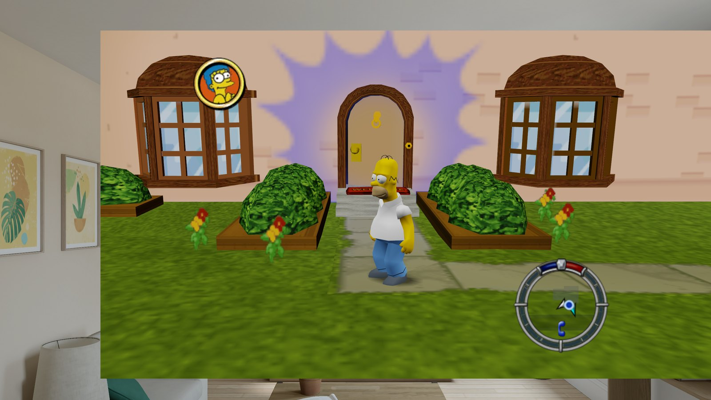
  <br><sub>The Window view, in the visionOS Simulator's living room.</sub>
</p>

*The Simpsons: Hit & Run* (2003) running natively on Apple Vision Pro, in six degrees of freedom.
Walk Homer around Springfield with a PS VR2 Sense controller in each hand, wreck traffic from the
driver's seat, or hang the whole town on your wall as a window you can lean into. No PC, no
streaming: just the headset.

SHAR VR is [Trevorbilt](https://trevorbilt.com)'s native visionOS port, built on
[kote2345's Meta Quest mod](https://github.com/kote2345/The-Simpsons-Hit-and-Run-VR): you bring the
game, you build the app, Springfield does the rest.

> [!IMPORTANT]
> There are no game files and no app download here. You need your own PC copy of *The Simpsons:
> Hit & Run* and a Mac to build with. SHAR VR is a fan project. It isn't affiliated with or endorsed
> by Disney, 20th Television, Fox, Vivendi, Activision or Radical Entertainment.

## What you get

- **Three ways to play**, switchable from the game's own VR menu:
  - **Full**: the game all around you, in stereo, tracking your head. Menus, loading screens and
    films float in your room instead of a black void.
  - **Progressive**: a portal into Springfield that the Digital Crown widens and narrows.
  - **Window**: the town as a 3D scene behind a window, beside your other apps. It's rendered from
    wherever your eyes actually are, so you can lean in and look around corners.
- **Your hands, your call.** PS VR2 Sense controllers put Homer's hands where yours are. A
  DualSense, Xbox or other gamepad works too. No controller at all? In Full and Progressive, pinch
  your way around with your bare hands.
- **Sharper than it has any right to be.** SMAA or FXAA anti-aliasing, and Render Scale up to 150%.
- **Polite to your living room.** The Digital Crown recentres, the game's iris wipes fade into your
  room, and if you wander too far from where you started, the game fades out before you meet the
  coffee table.

<p align="center">
  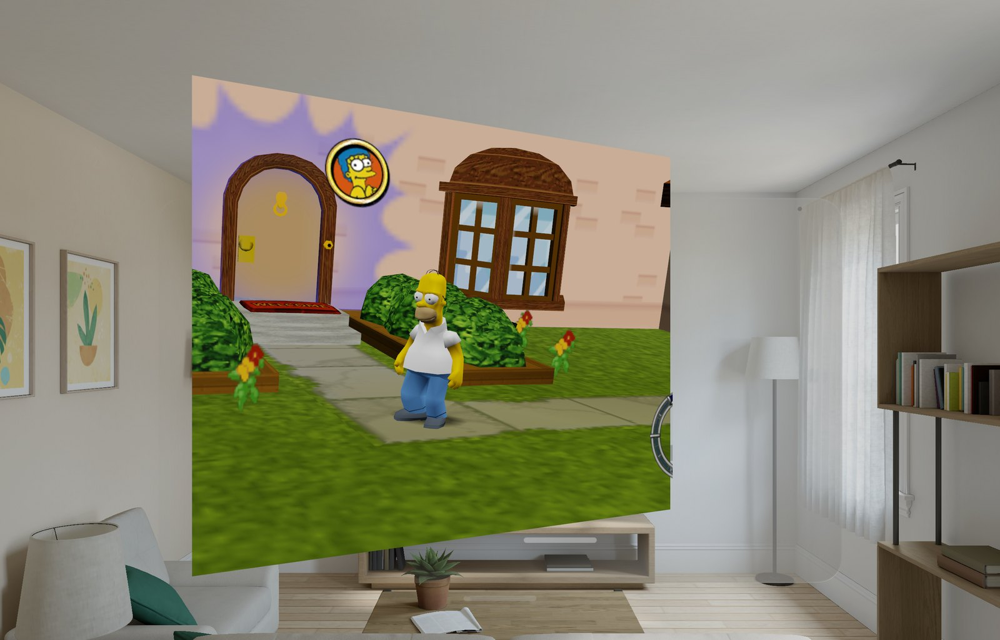
  <br><sub>The Window view from off to one side (Simulator again). That's real depth back there, not a picture.</sub>
</p>

## What you'll need

- **A headset:** Apple Vision Pro on visionOS 26 or later.
- **A Mac** with Apple silicon and Xcode 27, opened once so it finishes installing, with its
  visionOS platform (Xcode › Settings › Components). It's built and tested with Xcode 27.0.
- **Some tools:** [Homebrew](https://brew.sh), then `brew install cmake ninja pkgconf xcodegen`.
- **An Apple Account**, signed in to Xcode (Xcode › Settings › Accounts). A free one works; a paid
  developer membership saves you reinstalling every 7 days.
- **The game:** your installed PC copy of *The Simpsons: Hit & Run*, the folder with `art/` and the
  `.rcf` files.
- **Patience:** about 5 GB of free disk, and 10 to 20 minutes for the first build.

First time running your own app on a Vision Pro? Pair it with Xcode (Window › Devices and
Simulators) and turn on [Developer Mode](https://developer.apple.com/documentation/xcode/enabling-developer-mode-on-a-device)
on the headset. Apple's [guide to running on a device](https://developer.apple.com/documentation/xcode/running-your-app-on-simulated-or-physical-devices)
walks through both.

## Build it

1. **Get the code.**

   ```bash
   git clone https://github.com/edgytoast/shar-visionos.git shar-visionos
   cd shar-visionos
   ```

2. **Build the engine.** One script does it all: it clones the VR mod, patches it for Vision Pro,
   fetches what it depends on, builds the engine, and generates the Xcode project.

   ```bash
   ./scripts/build.sh
   ```

   It also sets up signing with the team you're signed in to Xcode with. If you're in more than one,
   it lists them at the end: copy `visionos/App/Local.xcconfig.example` to
   `visionos/App/Local.xcconfig` and put the one to sign with in it.

3. **Run it.** Open `visionos/App/SHARVR.xcodeproj`, choose your Apple Vision Pro as the run
   destination, and press ⌘R. With a free Apple Account, the headset won't open the app until you
   trust it: Settings › General › VPN & Device Management.

The full install guide, including everything the build does on your Mac, is
[AVP-INSTALL.md](AVP-INSTALL.md).

Got new changes (`git pull` on `main`, or `git fetch` and `git checkout` the commit the AVP Ports
Index lists now, if you came from it)? Run `./scripts/build.sh` again. It brings the engine up to
date and rebuilds only what changed.

Fancy the visionOS Simulator instead? `./scripts/build.sh simulator` (or `both`), then pick a Vision
Pro simulator in Xcode (Xcode downloads its runtime the first time). It's great for poking around,
but terrible at judging looks: its GPU isn't the headset's. [DEVELOPING.md](docs/DEVELOPING.md#testing-in-the-simulator)
has how to get the game into it.

## Bring your game

SHAR VR plays the files from your PC install: the folder that holds `art/` next to the `.rcf`
archives. Any of these get them onto the headset:

- **AirDrop**: zip that folder (RAR and 7z work too), AirDrop it to your Vision Pro, and choose
  **SHAR VR** from the list of apps to open it with. It's unpacked, installed and then deleted, so
  you don't keep two copies.
- **From Files**: put the archive or folder anywhere Files can reach, then tap **Import Game
  Files…** in SHAR VR and pick it.
- **By hand**: copy what's *inside* that folder (`art/`, the `.rcf` files and the rest) straight
  into SHAR VR's own folder in Files (On My Apple Vision Pro › SHAR VR), not into a folder of its
  own there.

With AirDrop and the importer, it doesn't matter how deep the game is nested: the app finds it.
Then tap **Play**.

## Play

Before you press **Play**, the launcher asks:

- **View**: Full, Progressive or Window. You can change it later in the game's VR menu, mid-game.
- **Show my room around menus** (Full only, on by default): menus and loading screens float in
  your room rather than in the dark. Gameplay is fully immersive either way.
- **Pace frames on the GPU (experimental)**, under **Advanced**: has the headset wait for each
  frame on the GPU instead of the CPU. It can help the frame rate. If Full or Progressive ever shows
  nothing, force quit SHAR VR (see below), open it again, and turn this off before you press **Play**.

**Sense controllers and gamepads** use the VR mod's layout in Full and Progressive, and the game's
tutorials name the buttons on whatever you're holding. Swing a tracked hand to attack. The **Window**
view plays like the original game, so it takes the original layout: A jumps, B sprints, X attacks,
Y talks and gets in and out of cars, and when you're driving, the right trigger is gas and the left
one brakes.

**Bare hands** play in Full and Progressive when no controller is connected. The launcher's
**Controls** tab shows every control on the headset, for hands, controllers and the Window view.

The launcher has four tabs. **Play** covers the above. **Controls** shows a drawing of whatever
you're holding (Sense controllers, a DualSense-style or Xbox-style pad, or your hands), labelling
every button that does something, on foot and driving. **Ports** lists other games ported to Vision
Pro from the [AVP Ports Index](https://github.com/edgytoast/avp-ports-index), with screenshots where
the index has them. **About** has the credits, licences and a privacy note, a Diagnostics sheet with
your build and system details for a bug report, and a button to check for updates.

| On foot | | |
|---|---|---|
| 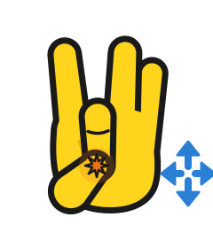 | **Walk** | Pinch and hold your left thumb and middle finger, then move your hand like a joystick. All the way to run. |
| 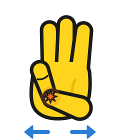 | **Turn** | Pinch and hold your right thumb and little finger, then move your hand sideways. Or just turn your body. |
| 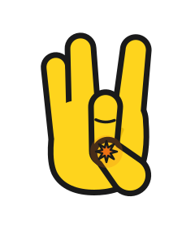 | **Act** | Pinch your right thumb and middle finger: talk, go through doors, get into a car. |
| 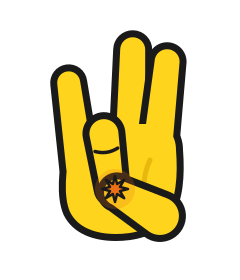 | **Jump** | Pinch your right thumb and ring finger. |
| 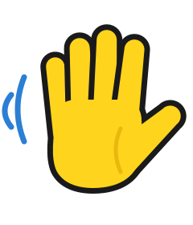 | **Attack** | Swing your hand at it. |
| 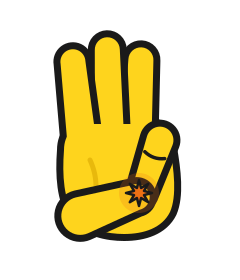 | **Pause** | Pinch your left thumb and little finger. |

| Driving | | |
|---|---|---|
| 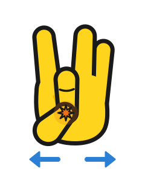 | **Steer** | Pinch and hold your left thumb and middle finger, then move your hand left and right. |
| 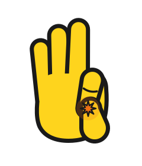 | **Gas** | Pinch and hold your right thumb and index finger. |
| 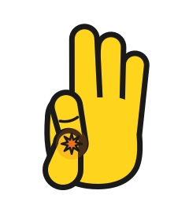 | **Brake and reverse** | Pinch and hold your left thumb and index finger. |
| 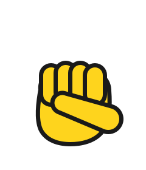 | **Handbrake** | Make a fist with your right hand, or pinch your right thumb and ring finger. |
| 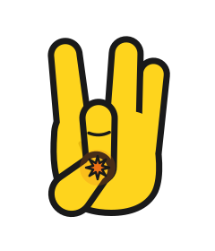 | **Horn** | Tap your left thumb and middle finger together. |
| 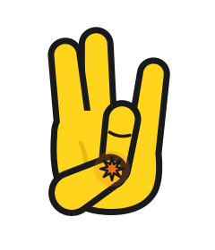 | **Get out** | Pinch your left thumb and ring finger, or your right thumb and middle finger. |

Rather steer with the wheel? Set **Vehicle Control** to **VR Wheel** in the game's VR menu, then
put your hands on the wheel's rim and turn it. Bare hands hold it without a fist, so the pinches for gas
and brake still work; Sense controllers hold it with the grips.

The **Window** view needs a controller: visionOS gives apps no hand tracking outside Full and
Progressive. Look at the game window to give it your controller, since visionOS hands a controller to
whichever window you're looking at.

The port's own options live in the game's settings: **VR › View** and **Move Direction** (follow your
head or your controller), and **Graphics › Anti-Aliasing** and **Render Scale**.

## If something goes sideways

- **`build.sh` says the upstream clone has changes that aren't in the patches**, or **was set up for
  a checkout at another path** (you moved this folder). Move the clone aside as the message says,
  and run `build.sh` again; it sets up a fresh one.
- **Xcode can't sign "Increased Memory Limit".** Some free accounts can't. Add
  `CODE_SIGN_ENTITLEMENTS =` to `visionos/App/Local.xcconfig` to build without it. The game then has
  less memory to play with, so a long session in a busy level may end early.
- **The app won't open after a week.** Apps signed with a free account expire after 7 days. Run it
  from Xcode again; your game files and saves stay put.
- **Full or Progressive shows nothing.** Force quit SHAR VR, open it again, and turn off "Pace
  frames on the GPU" (under **Advanced**) before you press **Play**. Closing its windows isn't
  enough: the game keeps running, paused, until it's force quit. Hold the top button and the Digital
  Crown until Force Quit Applications shows, then let go (held longer, they restart the headset),
  choose SHAR VR and tap **Force Quit**.
- **The Window view ignores your controller.** Look at it. See above.
- **Cleaning up.** The engine's build lives in `build/` here (or, if this folder's path has a space in
  it, in `~/Library/Developer/SHARVR`). Delete it to get the space back; `build.sh` makes a new one.
- **Anything else.** The app's log lines start with `[SharVisionOS]`, `visionOS:` or `[SHARVR]`. Run
  it from Xcode and the console tells you what happened.

## How it works

The game's own engine runs on its own thread inside a SwiftUI app. Its Vulkan renderer runs on Metal
through MoltenVK, and each frame goes to visionOS through CompositorServices. The VR mod's gameplay,
body, menus and steering wheel run as they are, with a visionOS runtime underneath in place of
OpenXR, which visionOS doesn't have. The Window view is the odd one out: visionOS gives apps no head
tracking there, so the game's 3D draws are recreated live in RealityKit, which renders them from
your real eyes.

The upstream engine never lives in this repository. `build.sh` clones it and applies the patches in
`patches/`; everything else here is new. The details are in [docs/HOW-IT-WORKS.md](docs/HOW-IT-WORKS.md),
and [docs/DEVELOPING.md](docs/DEVELOPING.md) covers changing it and testing it.

## Support

SHAR VR is made and maintained by [Trevorbilt](https://trevorbilt.com). If it made your day, come see
what else is on the workbench.

## Credits

SHAR VR stands on some very big, very yellow shoulders:

- **[Radical Entertainment](https://en.wikipedia.org/wiki/Radical_Entertainment)** made *The
  Simpsons: Hit & Run*, published in 2003 by Vivendi Universal Games and Fox Interactive.
- **[ZenoArrows](https://github.com/ZenoArrows/The-Simpsons-Hit-and-Run)** ported the game's original
  source code (by way of [Svxy's repository](https://github.com/Svxy/The-Simpsons-Hit-and-Run)) to
  Nintendo Switch and PS Vita.
- **[Carlox33](https://github.com/Carlox33/The-Simpsons-Hit-and-Run-Android)** took that to Android.
- **[kote2345](https://github.com/kote2345/The-Simpsons-Hit-and-Run-VR)** made it VR: the first-person
  gameplay, the body, the steering wheel, the stereo HUD and menus. This port builds directly on that
  work.
- **[MoltenVK](https://github.com/KhronosGroup/MoltenVK)**, **[SDL](https://www.libsdl.org)**,
  **[OpenAL Soft](https://openal-soft.org)**, **[FFmpeg](https://ffmpeg.org)** and
  **[SMAA](https://github.com/iryoku/smaa)** do a lot of the heavy lifting. Their licenses are listed
  in [THIRD_PARTY_NOTICES.md](THIRD_PARTY_NOTICES.md).

The Vision Pro port is [Trevorbilt](https://trevorbilt.com)'s: the visionOS runtime, the Window view's
scene mirror, the input, the app and the build, all built and tested on a real Vision Pro.

## License

Trevorbilt's own work here is [MIT licensed](LICENSE): the visionOS runtime, the app, the scripts,
the docs' text, and the changes in `patches/`. It doesn't cover:

- the upstream code those patches apply to, which has no license of its own and stays in its own
  repository;
- the game, its characters and its art, including what shows in the screenshots in `docs/images/`,
  which belong to their rights holders (and the game files, which are yours to bring);
- the Trevorbilt name and logo;
- the third-party code in [THIRD_PARTY_NOTICES.md](THIRD_PARTY_NOTICES.md), which keeps its own
  license.

<p align="center">
  <sub>Made with an unreasonable amount of donuts by <a href="https://trevorbilt.com">Trevorbilt</a>.</sub>
</p>
